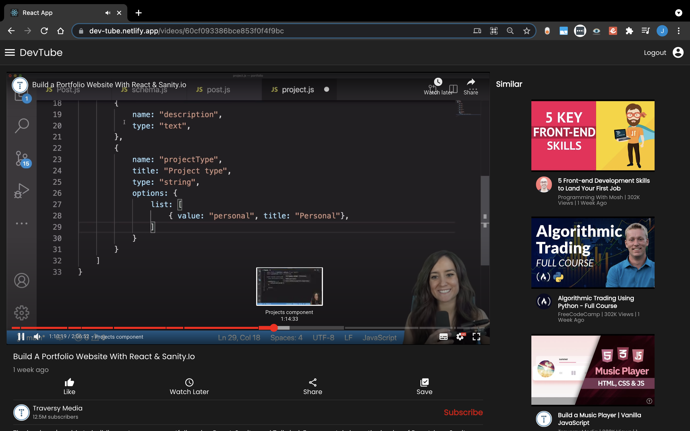

# DevTube - YouTube for Developers

A video streaming application built using MERN Stack.

## Features

-   Playlist management
-   Like videos
-   Save to watch later
-   User authentication

## Installation

```bash
  git clone https://github.com/JatinRanka/DevTube-Frontend.git
  cd DevTube-Frontend
```

#### To run project

```bash
  npm install
  npm start
```

#### To run test cases

```bash
  npm test
```

## Backend

https://github.com/JatinRanka/devtube-backend

## Demo

https://dev-tube.netlify.app

**Email** : demo@gmail.com
**Password** : pwd

### Home Page


### Video Page


